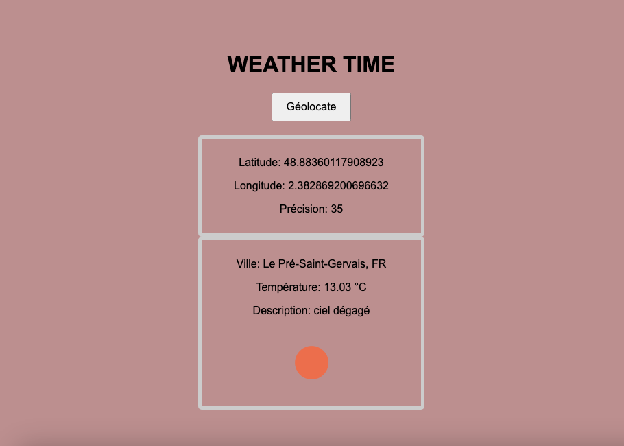

# Weather Time 🌦️

Projet d'application météo simple réalisé dans le cadre de ma formation, permettant d'obtenir les conditions météorologiques actuelles en fonction de la géolocalisation de l'utilisateur.

## Aperçu

_(Astuce : Faites une capture d'écran de votre application en fonctionnement et insérez-la ici. Sur GitHub, vous pouvez simplement glisser-déposer l'image dans la zone de texte.)_



## Description

Weather Time est une application web front-end qui utilise l'API de géolocalisation du navigateur pour récupérer les coordonnées de l'utilisateur. Ces coordonnées sont ensuite utilisées pour interroger l'API OpenWeatherMap et afficher en temps réel la météo locale, incluant la température, la description du temps et une icône représentative.

## Fonctionnalités

- **Géolocalisation en un clic** : Un simple bouton pour lancer la détection de la position.
- **Affichage des coordonnées** : Affiche la latitude, la longitude et la précision de la localisation.
- **Météo actuelle** : Présente la ville, la température en degrés Celsius, une description textuelle du temps et une icône visuelle.
- **Gestion des états** : Affiche des messages clairs à l'utilisateur pendant le chargement ou en cas d'erreur (ex: refus de géolocalisation, problème réseau).

## Technologies Utilisées

- **HTML5** : Structure sémantique de la page.
- **CSS3** : Style et mise en page (même si minimaliste).
- **JavaScript (ES6+)** : Logique de l'application, manipulation du DOM et appels API.
- **API Web** :
  - `Navigator.geolocation` : Pour obtenir les coordonnées de l'utilisateur.
  - `Fetch API` : Pour réaliser des requêtes HTTP asynchrones vers le service météo.
- **API Externe** :
  - OpenWeatherMap : Pour récupérer les données météorologiques.
- **Outils de développement** :
  - **Git & GitHub** : Pour le versioning du code et l'hébergement du projet.

## Installation et Lancement

Le projet ne nécessite aucune compilation ni dépendance complexe.

1.  Clonez le dépôt sur votre machine locale :
    ```bash
    git clone https://github.com/RALPHASSANE/APP-m-t-o.git
    ```
2.  Naviguez dans le dossier du projet :
    ```bash
    cd APP-m-t-o
    ```
3.  Ouvrez le fichier `index.html` dans votre navigateur web.

**Note** : L'application nécessite une connexion internet et l'autorisation de l'utilisateur pour accéder à sa position géographique.

## Défis et Apprentissages

Ce projet a été l'occasion de mettre en pratique plusieurs concepts clés du développement web :

- **Gestion de l'asynchronisme** : L'un des principaux défis a été de gérer correctement les opérations asynchrones. J'ai utilisé `fetch` avec les Promises (`.then()` et `.catch()`) pour enchaîner l'appel à l'API de géolocalisation puis l'appel à l'API météo, tout en gérant les cas d'erreur.

- **Interaction avec les API** : J'ai appris à lire la documentation d'une API externe (OpenWeatherMap), à construire une URL de requête avec des paramètres dynamiques (latitude, longitude, clé API) et à traiter la réponse JSON pour en extraire les informations pertinentes.

- **Amélioration de l'Expérience Utilisateur (UX)** : Initialement, l'interface était statique. J'ai amélioré l'UX en masquant les sections d'information vides au démarrage et en implémentant un conteneur de statut pour informer l'utilisateur du chargement ou des erreurs, offrant une expérience plus dynamique et intuitive qu'un simple `alert()`.

- **Résolution de problèmes (Versioning)** : J'ai également été confronté à des défis liés à la configuration de Git et GitHub, notamment des erreurs d'authentification (erreur 403). J'ai appris à diagnostiquer le problème (conflit d'identifiants dans le Trousseau macOS), à créer et utiliser un Personal Access Token (PAT) pour sécuriser la connexion, et à configurer correctement mon dépôt distant.

## Améliorations Possibles

Pour faire évoluer ce projet, plusieurs fonctionnalités pourraient être ajoutées :

- **Recherche par ville** : Ajouter un champ de recherche pour obtenir la météo de n'importe quelle ville dans le monde.
- **Prévisions météo** : Utiliser un autre endpoint de l'API pour afficher les prévisions sur plusieurs jours.
- **Design responsive** : Améliorer le CSS pour une présentation optimale sur tous les appareils (mobile, tablette, bureau).
- **Sauvegarde locale** : Utiliser `localStorage` pour sauvegarder la dernière ville consultée et l'afficher au prochain chargement.
